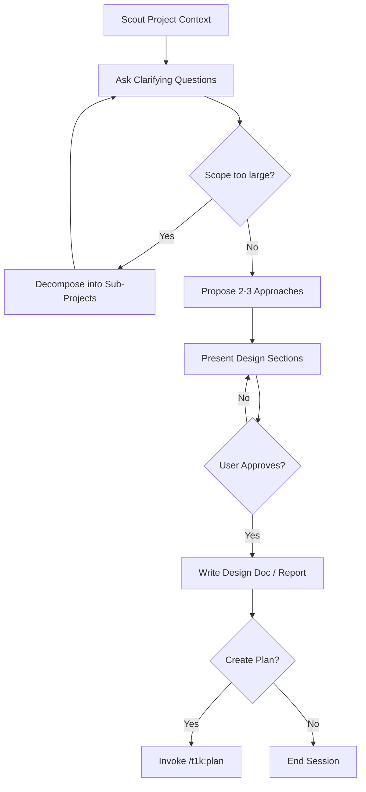

# TheOneKit Brainstorm -- Generic Ideation

Context-aware brainstorming. Routes to registered `t1k-brainstormer` agent via routing protocol.

**Principles:** YAGNI, KISS, DRY | Token efficiency | Concise reports

## Tool guard — `AskUserQuestion` is deferred

`AskUserQuestion` is a deferred tool: its name appears in the deferred-tools system-reminder but its schema is NOT loaded at session start. Direct invocation fails with `InputValidationError`.

**Operational pre-step (mandatory before drafting any structured multi-option question):**

1. Verify `AskUserQuestion` is in the loaded tool list. If not, run:
   ```
   ToolSearch(query="select:AskUserQuestion", max_results=1)
   ```
2. THEN draft and invoke the tool with batched options.

**Failure mode this guard prevents:** assistant remembers the rule, drafts the question correctly in its head, then because the tool isn't loaded, falls back to "I'll just write the options as prose, and call the tool next time." Drafting prose bullets first is a violation — see `rules/always-ask-on-unresolved.md` "Forbidden prose" table. Especially relevant in brainstorm endgame: "Open questions before I write the plan" lists are the canonical violation pattern.

## Agent Routing
Follow protocol: `skills/t1k-cook/references/routing-protocol.md`
This command uses role: `t1k-brainstormer`

## Skill Activation
Follow protocol: `skills/t1k-cook/references/activation-protocol.md`

<HARD-GATE>
Do NOT invoke any implementation skill, write any code, scaffold any project, or take any implementation action until you have presented a design and the user has approved it.
This applies to EVERY brainstorming session regardless of perceived simplicity.
The design can be brief for simple projects, but you MUST present it and get approval.
</HARD-GATE>

## Anti-Rationalization

| Thought | Reality |
|---------|---------|
| "This is too simple to need a design" | Simple projects = most wasted work from unexamined assumptions. |
| "I already know the solution" | Then writing it down takes 30 seconds. Do it. |
| "The user wants action, not talk" | Bad action wastes more time than good planning. |
| "Let me explore the code first" | Brainstorming tells you HOW to explore. Follow the process. |
| "I'll just prototype quickly" | Prototypes become production code. Design first. |

## Process Flow (Authoritative)



**This diagram is the authoritative workflow.** If prose conflicts with this flow, follow the diagram.

## Process Steps

1. **Scout Phase**: Use `/t1k:scout` to discover relevant files and code patterns, read relevant docs in `<project-dir>/docs` directory
2. **Discovery Phase**: Use `AskUserQuestion` to ask clarifying questions about requirements, constraints, timeline, and success criteria
3. **Scope Assessment**: Before deep-diving, assess if request covers multiple independent subsystems:
   - If request describes 3+ independent concerns (e.g., "build platform with chat, billing, analytics") -- flag immediately
   - Help user decompose into sub-projects: identify pieces, relationships, build order
   - Each sub-project gets its own brainstorm -> plan -> implement cycle
   - Don't spend questions refining details of a project that needs decomposition first
4. **Research Phase**: Spawn `t1k-researcher` agents for relevant patterns and industry practices
5. **Analysis Phase**: Evaluate multiple approaches with project-specific criteria
6. **Debate Phase**: Present options with tradeoffs table via `AskUserQuestion`
7. **Consensus Phase**: Align on approach and document decisions
   - **MANDATORY:** If ANY open question remains at design-presentation time — ALWAYS invoke `AskUserQuestion` (batch up to 4 per call). NEVER list open questions as prose bullets followed by "pick one". This applies to questions raised AFTER the main debate too, not just during step 6. See `rules/ask-before-deciding.md` → "Failure mode — post-design open questions" for the exact pattern to avoid.
8. **Documentation Phase**: Report to `plans/reports/` using naming pattern from injected context
9. **Finalize Phase**: Use `AskUserQuestion` to ask if user wants `/t1k:plan`
   - If `Yes`: Run `/t1k:plan` with the brainstorm summary context as the argument
   - If `No`: End the session

## Evaluation Criteria (apply to every idea)
- **Reusability**: shared library vs project-only code?
- **Maintainability**: does this reduce or increase complexity?
- **Testability**: can this be unit-tested?

## Output Requirements

When brainstorming concludes with agreement, create a detailed summary report including:
- Problem statement and requirements
- Evaluated approaches with pros/cons
- Final recommended solution with rationale
- Implementation considerations and risks
- Success metrics and validation criteria
- Next steps and dependencies

Sacrifice grammar for the sake of concision when writing outputs.

## Skill Inventory Injection (if `installedModules` or `modules` present in metadata.json)

Same pattern as `/t1k:plan`:
1. Read `.claude/metadata.json` -> installed modules
2. Read ALL `t1k-activation-*.json` -> skill names grouped by module
3. Inject inventory into t1k-brainstormer prompt (names only, not activation)

When brainstorming, check inventory for:
- Existing solutions (skill already covers this -> reuse)
- Module gaps (no skill for this domain -> suggest new skill)
- Cross-module opportunities (spans 2+ modules -> flag boundary decision)

## Module-Aware Feasibility (if `installedModules` or `modules` present in metadata.json)
- Check if installed module already provides this capability
- Check if AVAILABLE (not installed) module solves this
- If proposing new skills, identify which module they belong to

## Subagent Skill Injection (if installedModules present in metadata.json)
Follow protocol: `skills/t1k-cook/references/subagent-injection-protocol.md`
Before spawning t1k-brainstormer agent, inject module context.

## Critical Constraints
- DO NOT implement -- brainstorm and advise only
- Check existing code before proposing new systems
- Validate feasibility before endorsing
- Prioritize long-term maintainability over short-term convenience

## Execution Trace (if features.executionTrace enabled)
After task completes, output compact trace.

