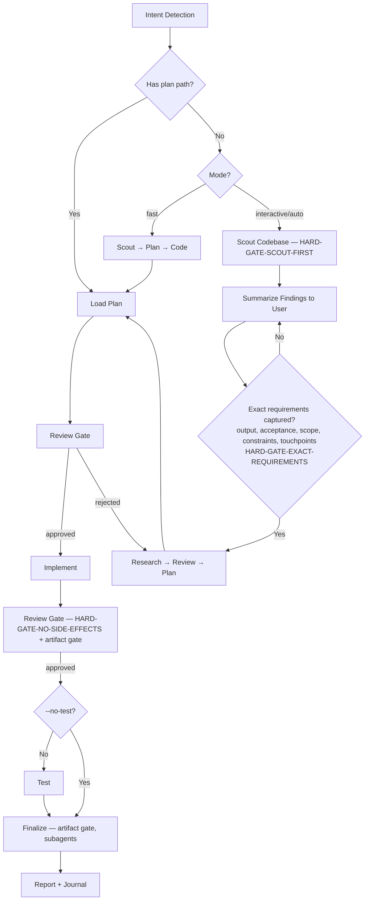

# TheOneKit Cook -- Feature Implementation

End-to-end feature implementation. Routes to the registered implementer agent for the current kit. Plan before code; harness over hope.

> **Kit-wide discipline:** features and changes that touch kit-owned content (anything under `.claude/`) ship via the owning kit source repo per [`rules/kit-wide-fix-discipline.md`](../../rules/kit-wide-fix-discipline.md). Local-only edits regress on next `t1k modules update` — implement in the kit, release picks it up.

**Principles:** YAGNI, KISS, DRY | Token efficiency | Concise reports

## Pre-flight Step 0 — Fuzzy plan/path arg resolution (MANDATORY)

If the user's arg is not an exact existing path (e.g. `chaosforge-demo`, `plans/chaosforge-demo`, `phase-3`, empty / "active plan"), run the Fuzzy Plan / Path Resolution Protocol at `references/fuzzy-plan-resolution.md` BEFORE intent detection or bail.

The skill MUST NOT emit "no plan matching" / "exact path required" until the protocol has been applied and its Step 6 reached. The protocol uses only `Bash` + `Glob`, which are always available.

## Tool guard — `AskUserQuestion` is deferred

`AskUserQuestion` is deferred (name in the system-reminder, schema NOT loaded; direct call → `InputValidationError`). Before drafting any structured multi-option question, if it's not in the loaded tool list run `ToolSearch(query="select:AskUserQuestion", max_results=1)` THEN invoke it. Drafting prose option-bullets first (instead of loading the schema) is a violation. Full rule: `rules/ask-before-deciding.md` + `rules/always-ask-on-unresolved.md` "Forbidden prose" table.

## Decision tree — which path do I take?

Pick by intent; keep loading minimal.

| Intent | Path |
|---|---|
| Ship a feature end-to-end with research + tests + review | Default `--interactive` workflow below |
| Plan exists already; execute it | Pass plan path; mode auto-detects to `code` |
| Skip research; you trust the spec | `--fast` (still requires plan step) |
| Multiple unrelated features at once | `--parallel` (sub-agents on disjoint files) |
| Test-driven: tests first, then code | `--tdd` (incompatible with `--parallel` / `--no-test`) |

## Usage
```
/t1k:cook <natural language task OR plan path>
```

**IMPORTANT:** If no flag is provided, the skill uses `interactive` mode by default.

**Optional flags:** `--interactive` (default) | `--fast` (skip research) | `--parallel` (multi-agent) | `--no-test` | `--auto` (auto-approve LOW-RISK steps only) | `--tdd` (test-driven: write tests first, implement, verify)

**Auto mode contract:** `--auto` is NOT "AI does whatever it wants." `--auto` runs when there is enough evidence (5 artifacts validated by the artifact-gate hook) AND risk is in the allowed zone (`risk-gate.json` `highRisk: false`). High-risk changes always stop for human approval before finalize/commit/ship, even in auto mode. Full rules: `references/artifact-gate-rules.md`.

## Agent Routing
Follow protocol: `skills/t1k-cook/references/routing-protocol.md` — role: `implementer`

## Skill Activation
Follow protocol: `skills/t1k-cook/references/activation-protocol.md`

HARD-GATE contract: see `rules/workflow-gates.md` (auto-loaded).

Full enforceable detail for all four gates: `references/hard-gates.md`. Markers below are the machine-readable contract; the one-line summaries are authoritative-by-reference.

<HARD-GATE>
No implementation code until a plan exists and has been reviewed — regardless of task simplicity. Exception: `--fast` skips research but still requires a plan. Override: user says "just code it"/"skip planning". Detail: `references/hard-gates.md` § HARD-GATE.
</HARD-GATE>

<HARD-GATE-SCOUT-FIRST>
Before planning OR questions, scan the codebase; emit the 5 mandatory scout outputs (project type, relevant modules, conventions, docs/plans, affected contracts) + a 3–6 bullet context summary. Skip only when input is a `plan.md`/`phase-*.md` path. Detail: `references/hard-gates.md` § Scout-First.
</HARD-GATE-SCOUT-FIRST>

<HARD-GATE-EXACT-REQUIREMENTS>
Before a plan, answer all 5 in one concrete sentence each (via `AskUserQuestion`, scout-grounded — never on vague intent): expected output, acceptance criteria, scope boundary, non-negotiable constraints, touchpoints. Skip only when input is a plan path. Detail: `references/hard-gates.md` § Exact-Requirements.
</HARD-GATE-EXACT-REQUIREMENTS>

<HARD-GATE-NO-SIDE-EFFECTS>
Not done until review+test gates prove all 5: matches acceptance, all (incl. shared-contract) tests pass, no touchpoint regression, no new lint/type/build errors, public contracts unchanged (or intentional+noted). `--no-test` downgrades item 2 to a surfaced warning. Side effect → STOP, `AskUserQuestion` with options. Detail: `references/hard-gates.md` § No-Side-Effects.
</HARD-GATE-NO-SIDE-EFFECTS>

Anti-rationalization discipline: see `rules/agent-anti-rationalization.md` (auto-loaded).

## Process Flow (Authoritative)



**This diagram is authoritative.** If prose in this skill or its references conflicts with this flow, follow the diagram.

## Smart Intent Detection

Mode from input: `plan.md`/`phase-*.md` path → **code** · "fast"/"quick" → **fast** · "trust me"/"auto" → **auto** (low-risk auto-approve, stop on high-risk) · 3+ features/"parallel" → **parallel** · "no test"/"skip test" → **no-test** · "tdd"/"test first" → **tdd** · default → **interactive**. Full detection logic: `references/intent-detection.md`.

## Workflow

```
[Intent Detection] -> [Drift Check] -> [Scout HARD-GATE] -> [Requirements HARD-GATE] -> [Research?] -> [Review] -> [Plan] -> [Review] -> [Implement] -> [Review + Artifact Gate] -> [Test?] -> [Review] -> [Finalize + Artifact Gate]
```

**Drift Check (Step 0.5, MANDATORY):** before any research/plan/code, run a quick `git fetch` + scan of recent merges (default branch, last ~24h) to confirm a teammate hasn't already shipped this fix or partially addressed it. Applies in ANY repo where cook runs — kit source, consumer game project, library, anywhere. Skips silently for non-git or no-remote directories. Procedure + decision tree: `references/workflow-steps.md` § "Step 0.5".

**Issue Claim (when routing a fix/issue-driven workflow):** cook defers to the same Step 0.5 claim gate defined in `t1k:fix` — enforced via the shared `.claude/scripts/t1k-issue-claim.cjs` and `rules/issue-claim-discipline.md`. No separate gate logic here.

| Mode | Research | Testing | Review Gates |
|------|----------|---------|--------------|
| interactive | yes | yes | User approval at each step |
| auto | yes | yes | Auto only if all 5 artifacts PASS AND `risk-gate.json` `highRisk: false`. Score alone NEVER auto-approves. |
| fast | no | yes | User approval at each step |
| parallel | optional | yes | User approval at each step |
| no-test | yes | no | User approval at each step |
| code | no | yes | User approval per plan |
| tdd | yes | yes (3.T/3.I/3.V) | User approval at each step |

Full step definitions: `references/workflow-steps.md`
TDD sub-step details: `references/workflow-steps.md` → `## --tdd Flag Behavior`
Review processes: `references/review-cycle.md`

### Guards

- `--tdd + --parallel`: REFUSE with error: "TDD requires strict ordering (tests → implement → verify); parallel execution cannot preserve this. Use `--tdd` alone, or `--parallel` without `--tdd`. For a fast sequential path, consider `--tdd --fast`."
- `--tdd + --no-test`: REFUSE with error: "TDD mode inherently requires the test suite; `--no-test` is contradictory. Remove one of the flags."
- `--tdd + --parallel` is unsupported and will error. Do not attempt to combine them.
- `--auto + --interactive`: existing guard, unchanged.
- `--parallel` **contract-first gate** (`rules/contract-first-integration.md`): before spawning parallel implementers whose outputs meet at a shared boundary (API ↔ client, producer ↔ consumer, two modules), DEFINE the integration contract — exact path/method, payload field names + types + **casing**, enums, success/error envelope, null semantics — and embed it **verbatim** in every implementer's brief (or point all at the SSOT types/schema file). Per-side typecheck cannot catch a contract mismatch; the post-implement `t1k-code-reviewer` MUST assert both sides honor the contract.

## Artifact Gate (harness for the review + finalize stages)

After implementing, write the 5 required artifacts and validate via the workflow-artifact-gate hook. **Full rules, schemas, kill switch, and engine-kit extension contract: `references/artifact-gate-rules.md`.** SSOT shared with `t1k:fix`.

## Required Subagents — CRITICAL ENFORCEMENT

Testing, Review, and Finalize phases **MUST** spawn subagents via the Task tool (separation of cognitive powers — the implementer is not the reviewer; the planner is not the coder). Phase → agent: Research→`t1k-researcher` · Plan→`t1k-planner` · Implement→`implementer` (kit-resolved) · UI→`ui-ux-designer` · Test→`t1k-tester`/`t1k-debugger` · Review→`t1k-code-reviewer` (acceptance + no-regression + contracts + patterns + clean-build checks) · Finalize→`t1k-project-manager`+`t1k-docs-manager`+`t1k-git-manager`. Full table + per-agent rationale + injection protocol: `references/subagent-patterns.md`.

**If workflow ends with 0 Task tool calls, it is INCOMPLETE.** Same context = same blind spots; multi-agent sharing one context with no acceptance criteria and no artifacts is just many-people-being-wrong-together.

**Finalize (never skip):** t1k-project-manager → plan sync-back | t1k-docs-manager → update `./docs` | t1k-git-manager → commit offer

- When you discover a non-obvious gotcha while implementing, emit a
  `[t1k:lesson kit="..." skill="..." fragment="..." reason="..."]` marker
  in your final message. The lesson-collector hook queues it for
  follow-up sync-back automatically.

## Blocking Gates (Non-Auto Mode)

Human review required at: Post-Research, Post-Plan, Post-Implementation, Post-Testing (100% pass required).

Always enforced (every mode): 100% test pass (unless `--no-test`), artifact-gate validation, code-reviewer subagent invocation. Score is advisory; only artifact validation approves.

## When implementation goes wrong — recovery via rollback

Corrupted `~/.claude/` state (bad merge, mis-applied prefix, broken hooks) → use H7 rollback, not manual cleanup: `t1k rollback --kit <name> --to-snapshot pre-<previous-version>`. If the snapshot doesn't exist (pipeline doesn't auto-snapshot as of cli@v4.14.0), fall back to `t1k install --reset` (takes its own backup). NEVER `rm -rf ~/.claude/` — <!-- gate:allow-rm-claude (rule statement) --> the gate forbids it. Full procedure (snapshot cap, `pre-` prefix rule, non-destructive restore caveat): `references/rollback-recovery.md`.

## Environment Variables

T1K resolves env vars in priority order — never hardcode values. Details: `references/env-hierarchy.md`

Artifact-gate-specific:
- `T1K_WORKFLOW_ARTIFACT_DIR` — pin the active artifact dir (overrides pointer file)
- `T1K_WORKFLOW_ARTIFACT_GATE_DISABLED=1` — kill switch (use only when debugging the hook itself)

## References

- `references/intent-detection.md` — detection rules and routing logic
- `references/workflow-steps.md` — detailed step definitions for all modes
- `references/review-cycle.md` — interactive and auto review processes
- `references/subagent-patterns.md` — subagent invocation patterns
- `references/env-hierarchy.md` — .env resolution hierarchy
- `references/god-prefab-extraction-risk.md` — plan-phase detection for god-prefab moves to Addressables; required audit during Step 2 when removing prefabs from scenes
- `references/runtime-smoke-gate.md` — Step 3 HARD-GATE: runtime Play Mode smoke required when scene/prefab assets are touched; prevents the The1Studio/theonekit-core#176 NRE-cascade incident class
- `.claude/schemas/workflow-artifact-*.schema.json` — 5 artifact schemas validated by the gate

## Contribution Scoring

If Finalize opens a PR, invoke `t1k:contribution-score` with `type=sync-back-pr` + PR URL/title/body. Fire-and-forget; SSOT gates non-T1K repos. See `.claude/skills/t1k-contribution-score/SKILL.md`.

## Sub-Agent Fork Hygiene

**Sub-agent forking:** see `skills/t1k-architecture/references/fork-hygiene.md`.
