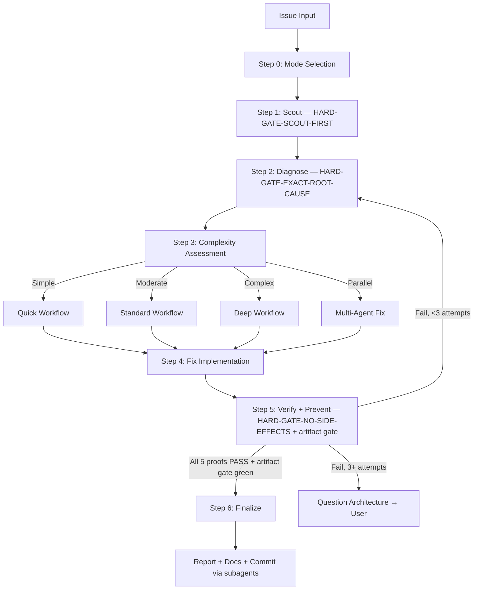

# TheOneKit Fix — Bug Fixing

Fix issues with intelligent classification and registry-based routing. Investigate before patching; harness over hope.

> **Kit-wide discipline:** every fix to kit-owned content (anything under `.claude/`) lands in the owning kit source repo per [`rules/kit-wide-fix-discipline.md`](../../rules/kit-wide-fix-discipline.md). Local-only patches regress for every other consumer on next `t1k modules update`.

## Pre-flight Step 0 — Fuzzy plan/path arg resolution (MANDATORY)

If the user provides a fuzzy plan/path/phase arg (e.g. `chaosforge-demo`, `plans/chaosforge-demo`, `phase-3`), an empty arg, or natural-language ref like "active plan" / "current plan" / "this plan", run the Fuzzy Plan / Path Resolution Protocol at `skills/t1k-cook/references/fuzzy-plan-resolution.md` BEFORE bail. Skill MUST NOT emit "no path matching" / "exact path required" until that protocol has been applied and Step 6 reached.

## Tool guard — `AskUserQuestion` is deferred

`AskUserQuestion` is a deferred tool: its name appears in the deferred-tools system-reminder but its schema is NOT loaded at session start. Direct invocation fails with `InputValidationError`.

**Operational pre-step (mandatory before drafting any structured multi-option question):**

1. Verify `AskUserQuestion` is in the loaded tool list. If not, run:
   ```
   ToolSearch(query="select:AskUserQuestion", max_results=1)
   ```
2. THEN draft and invoke the tool with batched options.

**Failure mode this guard prevents:** assistant remembers the rule, drafts the question correctly in its head, then because the tool isn't loaded, falls back to "I'll just write the options as prose, and call the tool next time." Drafting prose bullets first is a violation — see `rules/always-ask-on-unresolved.md` "Forbidden prose" table.

## Step 0.5 — Issue Claim Gate (fires ONLY when a target GitHub issue is supplied)

Before Scout/Diagnose, claim the issue via the SSOT script — never `gh issue edit`/`gh pr create` for claiming yourself: `node .claude/scripts/t1k-issue-claim.cjs check <owner/repo#N>`. On `state:"held"` → HARD BLOCK (surface holder+PR; `--steal` to override). On `"free"`/`--steal` → `acquire` + open the WIP draft PR (the draft IS the claim), then re-run `acquire … --pr <N>` for the deterministic tie-break. `release` marks it ready when the fix lands. Full state table + tie-break + finalize: `references/issue-claim-gate.md`. Enforcement: `rules/issue-claim-discipline.md`.

## Decision tree — which path do I take?

Pick by intent; keep loading minimal.

| Intent | Path |
|---|---|
| Diagnose and fix one bug end-to-end | Default `--auto` (Steps 1–6 below) |
| Trivial issue (lint, single type error) | `--quick` (skips deep diagnose) |
| Want human checkpoint before applying fix | `--review` |
| Multiple unrelated bugs at once | `--parallel` (sub-agents per issue) |
| 3+ fix attempts already failed | STOP — escalate to architecture discussion (HARD-GATE below) |

## Arguments

| Flag | Description |
|------|-------------|
| `--auto` | Autonomous mode (**default**). High-risk fixes stop for human approval before finalize/commit/ship (per artifact-gate). |
| `--review` | Human-in-the-loop review mode |
| `--quick` | Quick mode for trivial issues |
| `--parallel` | Route to parallel `implementer` agents per issue |

**Auto mode contract:** `--auto` is NOT "AI does whatever it wants." `--auto` runs when there is enough evidence (5 artifacts validated by the artifact-gate hook) AND risk is in the allowed zone (`risk-gate.json` `highRisk: false`). High-risk changes always stop for human approval, even in auto mode. Full rules: `skills/t1k-cook/references/artifact-gate-rules.md`.

HARD-GATE contract: see `rules/workflow-gates.md` (auto-loaded).

Full enforceable detail for all four gates: `references/hard-gates.md`. Markers below are the machine-readable contract; the one-line summaries are authoritative-by-reference.

<HARD-GATE>
No fixes before Steps 1–2 (Scout + Diagnose). Symptom fixes = failure; find the cause, never guess. 3+ failed attempts → STOP, question the architecture with the user. Override: `--quick` (trivial lint/type). Detail: `references/hard-gates.md` § HARD-GATE.
</HARD-GATE>

<HARD-GATE-SCOUT-FIRST>
Scan the codebase BEFORE questions/hypotheses; emit the 5 mandatory scout outputs (project type, symptom file+callers, covering tests, recent commits, existing patterns) + a 3–6 bullet context summary. Kills the "imagined context" failure. Detail: `references/hard-gates.md` § Scout-First.
</HARD-GATE-SCOUT-FIRST>

<HARD-GATE-EXACT-ROOT-CAUSE>
No fix until all 6 slots are answered in one concrete sentence each: symptom (verbatim), repro, expected-vs-actual, root-cause (`file:line`), why-now, blast-radius. Any vague slot → `AskUserQuestion` or more scout, never guess. Detail: `references/hard-gates.md` § Root-Cause.
</HARD-GATE-EXACT-ROOT-CAUSE>

<HARD-GATE-NO-SIDE-EFFECTS>
Not done until Step 5 proves all 5: repro gone, affected tests pass, no blast-radius regression, no new lint/type/build errors, public contracts unchanged (or intentional + noted). Side effect found → STOP, `AskUserQuestion` with concrete options. Detail: `references/hard-gates.md` § No-Side-Effects.
</HARD-GATE-NO-SIDE-EFFECTS>

Anti-rationalization discipline: see `rules/agent-anti-rationalization.md` (auto-loaded).

## Process Flow (Authoritative)



**This diagram is authoritative.** If prose in this skill or its references conflicts with this flow, follow the diagram.

## Agent Routing

Follow protocol: `skills/t1k-cook/references/routing-protocol.md`
This command uses roles: `implementer`, `t1k-debugger`

## Skill Activation

Follow protocol: `skills/t1k-cook/references/activation-protocol.md`

## Workflow Steps

| Step | Name | Key Action | Reference |
|------|------|------------|-----------|
| 0 | Mode Selection | Ask user for workflow mode if no `--auto` | `references/mode-selection.md` |
| 1 | Scout | Map per HARD-GATE-SCOUT-FIRST; emit 3-6 bullet summary | `references/workflow-quick.md` |
| 2 | Diagnose | Answer 6 slots per HARD-GATE-EXACT-ROOT-CAUSE | `references/diagnosis-protocol.md` |
| 3 | Complexity | Classify: Simple/Moderate/Complex/Parallel | `references/complexity-assessment.md` |
| 4 | Fix | Implement per selected workflow; minimal changes only | `references/workflow-standard.md` |
| 5 | Verify + Prevent | Run 5 proofs per HARD-GATE-NO-SIDE-EFFECTS + artifact gate | `references/prevention-gate.md` |
| 6 | Finalize | Report, t1k-docs-manager, commit offer | — |

Detailed workflow diagrams: `references/fix-workflow-overview.md`

## Step 5 — Artifact Gate (harness)

After verifying the fix, write the 5 required artifacts and validate via the workflow-artifact-gate hook. **Full rules, schemas, kill switch, and engine-kit extension contract: `skills/t1k-cook/references/artifact-gate-rules.md`.** SSOT shared with `t1k:cook`.

## Complexity Routing

| Level | Indicators | Workflow |
|-------|------------|----------|
| **Simple** | Single file, clear error, type/lint | `references/workflow-quick.md` |
| **Moderate** | Multi-file, root cause unclear | `references/workflow-standard.md` |
| **Complex** | System-wide, architecture impact | `references/workflow-deep.md` |
| **Parallel** | 2+ independent issues OR `--parallel` | Parallel `implementer` agents |

Specialized: `references/workflow-ci.md`, `references/workflow-logs.md`, `references/workflow-test.md`, `references/workflow-types.md`, `references/workflow-ui.md`

## Always-Activate Skills

- `/t1k:scout` (Step 1) — understand before diagnosing
- `/t1k:debug` (Step 2) — systematic root cause investigation
- `/t1k:think` (Step 2) — structured hypothesis formation
- `/t1k:problem-solve` (Step 2, conditional) — auto-activate when 2+ hypotheses fail
- When you find that the skill content led you astray, emit a
  `[t1k:skill-bug kit="..." skill="..." bug="..." evidence="..."]`
  marker in your final message. The lesson-collector hook will queue a
  GitHub issue on the owning kit repo.

Full activation matrix: `references/skill-activation-matrix.md`

## Required Subagents — CRITICAL ENFORCEMENT

Step 5 (Verify) and Step 6 (Finalize) MUST use the Task tool to spawn:

| Phase | Subagent | Why |
|---|---|---|
| Step 5: Verify | `t1k-code-reviewer` | Checks (a) root cause addressed (not symptom-patched), (b) no business-logic regression in blast radius, (c) no new failure modes, (d) follows existing patterns from scout |
| Step 5: Verify | `t1k-tester` | Runs full test suite + targeted blast-radius tests |
| Step 6: Finalize | `t1k-docs-manager` | Updates `./docs` if changes warrant |
| Step 6: Finalize | `t1k-git-manager` | Commits via conventional-commit scope, never raw `git` |

**If workflow ends with 0 Task tool calls, it is INCOMPLETE.** Do not inline these steps — the value of multi-agent is the **cognitive separation of powers** (the implementer is not the reviewer; the diagnoser is not the patcher). Same context = same blind spots.

## Subagent Skill Injection

Follow protocol: `skills/t1k-cook/references/subagent-injection-protocol.md`

## Sub-Agent Fork Hygiene

**Sub-agent forking:** see `skills/t1k-architecture/references/fork-hygiene.md`.
