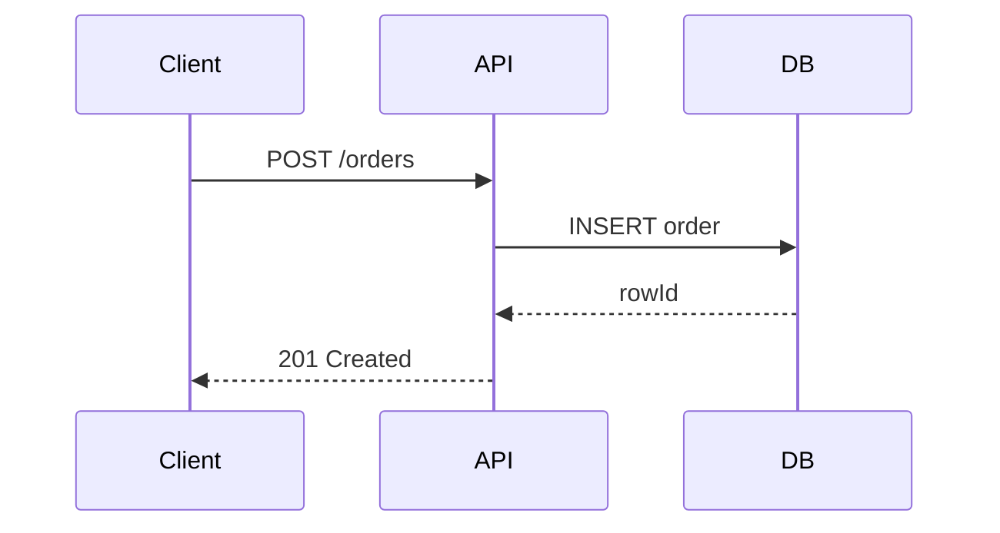
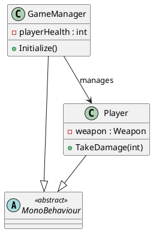
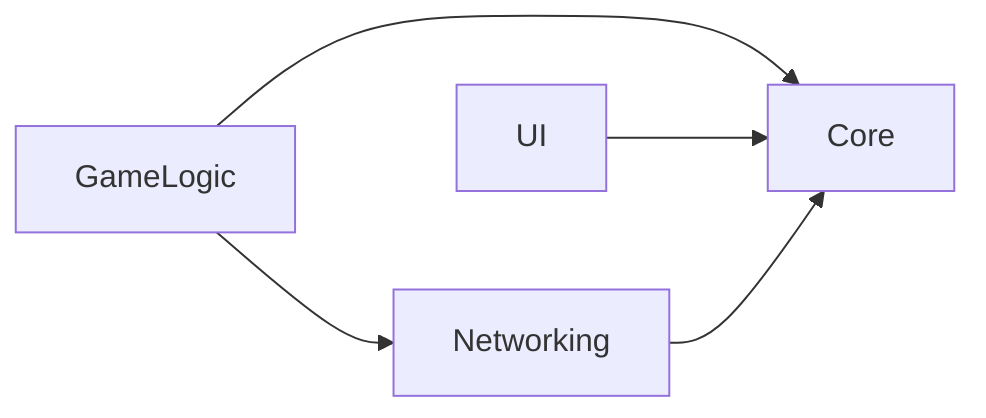
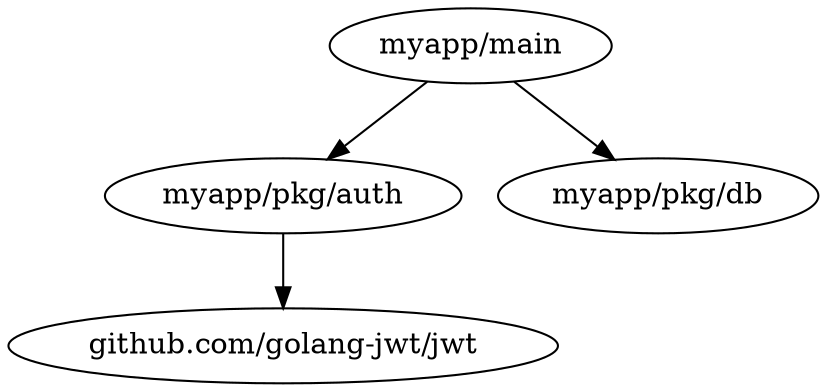

# Diagram Tool Selection

Decision reference for picking the right diagram syntax. Read this before generating any diagram.

## Capability Matrix

| Syntax | Flowchart | Sequence | Class (basic) | Class + inheritance | ER | Component | C4 | Module graph | Network | GitHub native | Claude native |
|--------|-----------|----------|---------------|---------------------|----|-----------|----|--------------|---------|---------------|---------------|
| **Mermaid** | ✅ | ✅ | ✅ | ✅ | ✅ | ✅ | ✅ (via C4 lib) | ✅ | ⚠️ partial | ✅ native | ✅ best |
| **PlantUML** | ✅ | ✅ | ✅ | ✅✅ richer | ✅ | ✅ | ✅ | ✅ | ✅ | ❌ proxy required | ✅ good |
| **D2** | ✅ | ✅ | ✅ | ✅ | ✅ | ✅✅ | ⚠️ manual | ✅ | ✅ | ❌ binary required | ✅ good |
| **C4/Structurizr** | ❌ | ❌ | ❌ | ❌ | ❌ | ✅ | ✅✅ best | ❌ | ❌ | ❌ proxy required | ⚠️ verbose |
| **Graphviz DOT** | ✅✅ | ❌ | ✅ | ✅ | ✅ | ✅ | ❌ | ✅✅ best | ✅ | ❌ binary required | ✅ good |

Legend: ✅ supported | ✅✅ best-in-class | ⚠️ partial/workaround needed | ❌ not supported

## 6 Hard Rules

**RULE 1 — Target is README, PR description, or any GitHub Markdown → Mermaid**
GitHub renders Mermaid code blocks natively since 2022. No extra steps required.
All other syntaxes require either a proxy server, a pre-rendered PNG/SVG, or a build step.

**RULE 2 — UML class diagram with inheritance, stereotypes, or generics → PlantUML**
PlantUML produces richer class diagrams: `<<abstract>>`, `<<interface>>`, `{field}`, visibility markers, and generic type parameters. Mermaid `classDiagram` covers basics but loses fidelity on complex hierarchies.
Trade-off: requires a rendering server or CI pre-generation for GitHub display.

**RULE 3 — Architecture at system/container/component level (C4 model) → C4/Structurizr or Mermaid with C4-PlantUML**
C4/Structurizr DSL is the most expressive for bounded contexts, external systems, and personas.
If GitHub rendering matters: use [C4-PlantUML](https://github.com/plantuml-stdlib/C4-PlantUML) macros in a PlantUML block, or the `C4Context` / `C4Container` Mermaid extension (v11+).

**RULE 4 — Module dependency / import graph from code → Graphviz DOT or Mermaid flowchart**
Tools like `dependency-cruiser`, `go mod graph`, `cargo-modules`, and `jdeps` output DOT natively.
Pipe DOT to Mermaid via `depcruise --output-type mermaid` when GitHub rendering is needed.
For large graphs (>50 nodes), DOT + `dot -Tsvg` produces a readable layout; Mermaid collapses.

**RULE 5 — Terminal output, no browser, no CI → ASCII**
Use `/t1k:preview --ascii` for all terminal-only contexts. No external renderer required.

**RULE 6 — Existing `.dot` / `.puml` / `.d2` file provided → honor its format, render only**
When `--from-file <path>` is passed, auto-detect syntax from the extension and render as-is.
Never convert between syntaxes unless the user explicitly asks.

## Default Rule

**When unsure → Mermaid.**
Mermaid is GitHub-native, Claude-native, and sufficient for the vast majority of diagrams.
Only deviate when a hard rule above applies.

## Decision Flowchart

```
Will this be read on GitHub / in a PR?
├── YES → Mermaid (RULE 1)
└── NO
    ├── Is this a C4 architecture diagram?
    │   ├── YES → C4/Structurizr (RULE 3)
    │   └── NO
    │       ├── Rich class diagram with inheritance?
    │       │   ├── YES → PlantUML (RULE 2)
    │       │   └── NO
    │       │       ├── Module dependency graph?
    │       │       │   ├── YES → DOT or Mermaid flowchart (RULE 4)
    │       │       │   └── NO
    │       │       │       ├── Terminal only?
    │       │       │       │   ├── YES → ASCII (RULE 5)
    │       │       │       │   └── NO → Mermaid (DEFAULT)
```

## Common Scenarios: Right Syntax per Use Case

### Scenario 1: Explain a request/response flow in a PR

**Correct syntax: Mermaid sequence**


### Scenario 2: Unity C# class hierarchy for architecture docs (internal wiki)

**Correct syntax: PlantUML** (stereotypes + visibility markers)


### Scenario 3: Module dependency graph in README

**Correct syntax: Mermaid flowchart** (via `dependency-cruiser --output-type mermaid`)


### Scenario 4: System architecture for a pitch deck (C4 context level)

**Correct syntax: C4/Structurizr DSL** (or Mermaid C4 extension for GitHub)
```
workspace {
    model {
        user = person "Player"
        system = softwareSystem "Game Backend" {
            api = container "API Server"
            db = container "PostgreSQL"
        }
        user -> system "Plays"
    }
}
```

### Scenario 5: Go module dependency graph piped from tool

**Correct syntax: Graphviz DOT** (native output from `go mod graph | modgraphviz`)


Then render: `dot -Tsvg deps.dot > deps.svg`

## Syntax Quick Reference

| Flag | Syntax chosen |
|------|---------------|
| `--syntax mermaid` | Mermaid (default) |
| `--syntax plantuml` | PlantUML — requires rendering server for GitHub |
| `--syntax d2` | D2 — requires `d2` binary |
| `--syntax c4` | C4/Structurizr DSL or Mermaid C4 extension |
| `--syntax dot` | Graphviz DOT — requires `dot` binary for SVG/PNG |

For flag usage in `/t1k:preview`, see `SKILL.md` → flags table.
For rendering tool installation, see `references/install-handlers.md`.
For adapter-generated diagrams, see `references/adapter-contract.md`.
