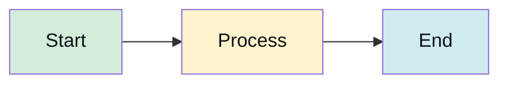
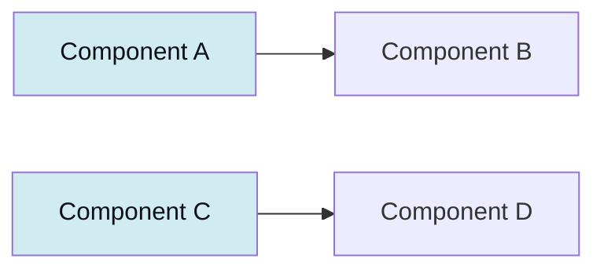
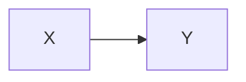
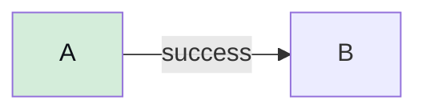

---

origin: theonekit-core
repository: The1Studio/theonekit-core
module: t1k-base
protected: true
---
# Mermaid Guidelines — Contrast, Palette, Patterns

## Why this exists

GitHub renders mermaid on both light and dark themes. Style declarations that specify `fill:` but NOT `color:` produce unreadable labels on whichever theme is the opposite of the designer's tested theme. This is a recurring class of wiki breakage; the validator + fixer eliminate it.

## The contrast rule

Every mermaid style line that sets a `fill:` MUST also set a `color:`.

### Good



### Bad

```mermaid
graph LR
    A[Start] --> B[Process] --> C[End]
    style A fill:#d4edda            ← unreadable on dark theme
    style B fill:#fff3cd            ← unreadable on dark theme
```

## Standard palette

For consistency across the wiki, use these fill + color pairs:

| Semantic | Fill | Color | Use case |
|---|---|---|---|
| Success | `#d4edda` | `#0d1117` | completed, passed, safe |
| Warning | `#fff3cd` | `#0d1117` | pending, in-progress, attention |
| Info | `#d1ecf1` | `#0d1117` | neutral info, reference |
| Danger | `#f8d7da` | `#0d1117` | failed, deprecated, risk |
| Primary | `#cce5ff` | `#0d1117` | important, emphasis |
| Muted | `#e2e3e5` | `#0d1117` | optional, deferred |

`color:#0d1117` is GitHub's primary text color on light theme AND dark enough to read on any of the pale fills above, regardless of active theme.

## `classDef` (preferred for repetition)

When 5+ nodes share the same style, `classDef` reduces duplication:



The validator and fixer cover `classDef` the same way they cover `style` — `fill:` without `color:` fails validation.

## Init directive

For theme-wide overrides, use the init block at the top of the diagram:



The validator does NOT require `color:` on individual styles when `primaryTextColor` is set in the init block — but it does require the init block to contain BOTH `primaryColor` AND `primaryTextColor` (a `primaryColor` alone leaves text unstyled).

## Arrow labels

Arrow labels use node color, not edge color:



If the label text appears unreadable, check that the source node has an explicit `color:`. Edge styling (`linkStyle`) is rarely needed.

## Auto-fix behavior

`fix-mermaid-contrast.cjs` injects `color:#0d1117` into every `style` or `classDef` line that has `fill:` but no `color:`. It is idempotent — running it on already-compliant diagrams is a no-op.

## Edge cases

- **Theme directives** (`%%{init: {'theme': 'dark'}}%%`) conflict with explicit styles. Validator reports a warning when both exist; pick one approach per diagram.
- **Gradient fills** (`fill:url(#grad1)`) are not supported by GitHub mermaid. Validator flags them.
- **Named colors** (`fill:red`) are allowed but discouraged — use hex for portability across mermaid versions.
- **Empty styles** (`style A`) are syntactically valid but a no-op. Validator warns.

## What NOT to do

- Do not rely on `theme: dark` alone — GitHub users can override theme via OS or site settings
- Do not use pure white text (`color:#fff`) on light fills — unreadable on light theme
- Do not use pure black (`color:#000`) on dark fills — unreadable on dark theme
- Do not skip the validator — the class of bugs it catches is silent in light-theme preview
